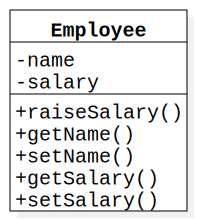
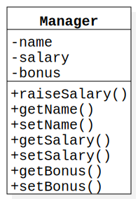
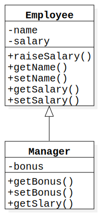

# 第六章 继承与多态

上一章我们介绍了类的定义以及如何定义类，给类加上属性、方法，控制他们对外的可见度。这一节我们要扩展视野，由单个类转向多个类，讨论类与类之间的关系——继承。以及基于继承的特性——多态。

既然我们要讨论类之间的继承关系，那么就先从创建两个类开始吧，首先创建一个员工类 `Employee` , 代码如下

```java
public class Employee {

    // employee name
    private String name;
    
    // employee salary
    private float salary;

    // raise salary by percentage
    public void raisesalary(float percent) {
        this.salary += this.salary * percent;
    }

    public String getName() {
        return this.name;
    }

    public void setName(String name) {
        this.name = name;
    }

    public float getsalary() {
        return this.salary;
    }

    public void setsalary(float salary) {
        this.salary = salary;
    }
}
```

其uml类图如下：



员工类包含了两个私有字段

* `name` 描述员工的姓名
* `salary` 描述员工的月薪

以及5个方法

* `getName` `setName` 用来获取和设置员工的姓名
* `getsalary` `setsalary` 用来获取和设置员工的月薪
* `raisesalary` 用来提高员工的月薪

之后创建一个经理类 `Manager` ，代码如下

```java
public class Manager {

    // manager name
    private String name;

    // manager salary
    private float salary;

    // manager bonus
    private float bonus;

    public float getBonus() {
        return this.bonus;
    }

    public void setBonus(float newBonus) {
        this.bonus = newBonus;
    }

    public void raisesalary(float percent) {
        this.salary += this.salary * percent;
    }

    public String getName() {
        return this.name;
    }

    public void setName(String name) {
        this.name = name;
    }

    public float getsalary(){
        return this.salary + this.bonus; 
    }

    public void setsalary(float salary) {
        this.salary = salary;
    }
} 
```

`Manager` 类的类图，如下：



经理类包含了3个私有字段

* `name` 描述经理的姓名
* `salary` 描述经理的月薪
* `bonus` 描述经理的奖金

以及7个方法

* `getName` `setName` 获取和设置经理的姓名
* `getsalary` `setsalary` 获取和设置经理的月薪
* `getBonus` `setBonus` 获取和设置经理的奖金
* `raisesalary` 提高经理的月薪

通过上面两个类的编写，大体上我们可以发现，大部分的内容其实是重复的。比方说它们都有 `name` 、 `salary` 属性，都有对应的 `getName`  `setName`  `getsalary`  `setsalary` 方法。同时他们两个类之间也有着一定的关系，那就是 **经理是一个员工 ( `Manager` is a `Employee` )** 这样的两个类之间就存在着继承关系。要表现这样的继承关系我们就可以这样改造我们的这两个类。

`Employee` 类和上面的一样不需要变化， `Manager` 类改为下面这样

```java
public class Manager extends Employee {

    private float bonus;

    public float getBonus() {
        return this.bonus;
    }

    @Override
    public float getsalary() {
        return super.getsalary() + this.bonus;
    }

    public void setBonus(float bonus) {
        this.bonus = bonus;
    }
}
```

类图如下：



对比之下使用继承在这个例子中减少了`Manager`类的复杂度。在深入解读上面代码之前现让我们认识一些概念。

## 6.1 类、超类、子类

### 6.1.1 类

类的概念已经在上一章详细介绍过了，详细请看[第五章](/posts/java/ch5_class_and_instance)，上面的例子中涉及到了两个类`Employee`和`Manager`。

### 6.1.2 超类

在上面的例子中`Employee`类称为`Manager`类的超类，超类一般是继承关系中更为抽象、广泛、通用的一方。例如水果和苹果，水果是更为抽象的一方，作为苹果的超类。

### 6.1.3 子类

在上面的例子中`Manager`类称为`Employee`类的子类，子类是继承关系中更为具体的一方。例如猫和动物，猫就是动物的子类。

子类会继承超类的可见属性和方法。

### 6.1.4 extends关键字

extends关键字用在子类上，用来指定要扩展（继承自）哪个类。

例如上面例子中的

```java
public class Manager extends Employee{
    //...
}
```

指定了`Manger`继承自`Employee`

> [info] java中只能进行单继承，即一个子类只能有一个超类，不能有多个超类

### 6.1.5 方法覆盖

上面的例子中新的`Manager`类的`getsalary`方法与`Employee`的`getsalary`方法有所不同。经理的月薪除了基本的月薪外，还应该加入奖金的部分。所以`Manager`类的`getsalary`方法需要对超类的相应方法进行覆盖。

```java
public float getsalary(){
    return this.bonus + super.getsalary();
}
```

### 6.1.6 super关键字

上面的方法中使用了`super`关键字，它的作用是告诉编译器使用超类的`getsalary`方法。

在上面的例子中子类中并没有`salary`属性，因为超类中的`salary`的访问修饰符是`private`。但同时超类提供了公共的`getsalary`方法，它通过继承使得我们当前的子类上也有了`getsalary`方法。一般的我们可以用`this.getsalary`进行调用。但是我们现在要覆盖子类的`getsalary`，如果要使用`self.getsalary`方法调用就会调用到我们重写的这个方法，形成递归调用。

这不是我们要的结果，我们要的是调用超类的`getsalary`方法，这时我们就可以使用`super.getsalary`来达成这样的目的。

### 6.1.7 多态

多态指的是，一个超类变量既可以引用一个超类对象也可以引用这个超类的任意一个子类对象，例如：

```java
// ok
Employee employee = new Employee();

// also ok 
Employee manager = new Manager();
```

### 6.1.8 final 关键字

`final`关键字暗示了被修饰的东西已经是最终形态，不能被改变了，它可以用在类上，如：

```java
public final class String
```

String类被`final`修饰，表示其他的类不能继承`String`类。

也可以在方法上加上`final`关键字，如：

```java
class Employee {
    // ...
    
    public final String getName() {
        return this.name
    }
    
    //...
}

```

这样被修饰的方法就不能被子类覆盖。

## 6.2 Object类

java中Object类是所有类的超类，每个类都是由它扩展而来，但是你并不需要这样写：

```java
class Employee extends Object
```

没有明确指出超类的Object就默认是这个类的超类

### 6.2.1 equals方法

`equals`方法用于检查一个对象是否和另一个对象相等

?__TODO__
