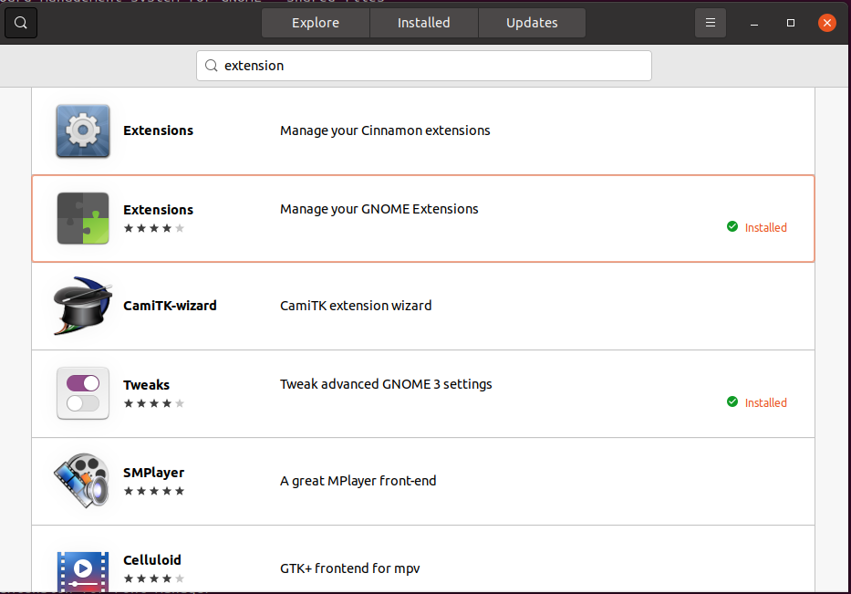
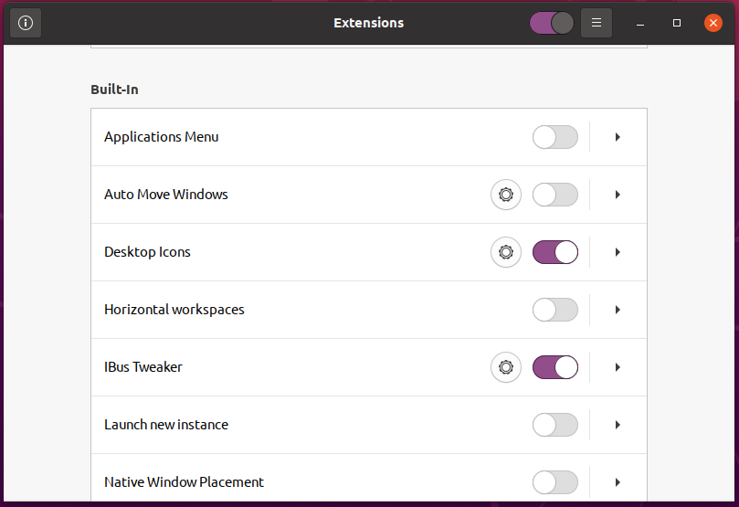
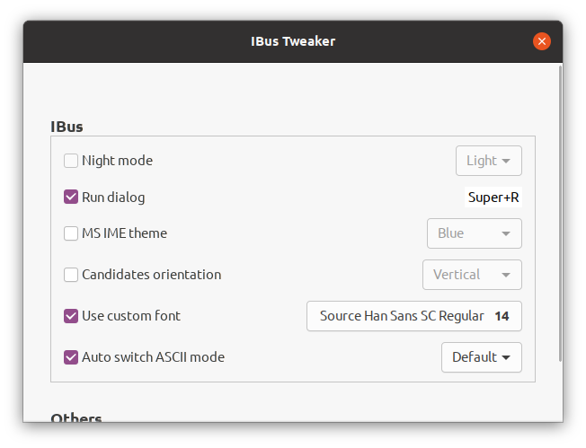

# Ubuntu中文字体设置

## 问题

发现Ubuntu操作系统Gnome桌面中文字体中有一些字显示很奇怪，表现是一些字显示的要比其他的窄。比如复杂的 `复`

## 查证

查找资料发现是因为这个显示的字体并不是 `简体中文` , 而是日文，日文中有许多和中文相似的字，使用了和中文相同的码位，但是字形和中文有些许不同。

## 环境

* 系统版本：Ubuntu 20.04.3 LTS
* Gnome版本： 3.36.8
* 输入法版本： Intelligent Pinyin 1.11.1

## 修改显示字体

修改 `/etc/fonts/conf.d/64-language-selector-prefer.conf`

将所有sc字体提前

```xml
<?xml version="1.0"?>
<!DOCTYPE fontconfig SYSTEM "fonts.dtd">
<fontconfig>
    <alias>
        <family>sans-serif</family>
        <prefer>
              <!-- 将noto sans cjk sc 提前 -->
            <family>Noto Sans CJK SC</family>
            <family>Noto Sans CJK JP</family>
            <family>Noto Sans CJK KR</family>
            <family>Noto Sans CJK TC</family>
            <family>Noto Sans CJK HK</family>
            <family>Lohit Devanagari</family>
        </prefer>
    </alias>
    <alias>
        <family>serif</family>
        <prefer>
              <!-- 将noto serif cjk sc 提前 -->
            <family>Noto Serif CJK SC</family>
            <family>Noto Serif CJK JP</family>
            <family>Noto Serif CJK KR</family>
            <family>Noto Serif CJK TC</family>
            <family>Lohit Devanagari</family>
        </prefer>
    </alias>
    <alias>
        <family>monospace</family>
        <prefer>
            <!-- 将noto sans mono cjk sc 提前 -->
            <family>Noto Sans Mono CJK SC</family>
            <family>Noto Sans Mono CJK JP</family>
            <family>Noto Sans Mono CJK KR</family>
            <family>Noto Sans Mono CJK TC</family>
            <family>Noto Sans Mono CJK HK</family>
        </prefer>
    </alias>
</fontconfig>
```

这样Ubuntu的显示字体就修改完了

## 输入法字体

中文ibus输入法的字体并不能随着显示字体的改变而变化，所以需要单独设置。

### 下载Extensions

从Ubuntu应用商店下载Extensions应用



### 下载ibus-tweaker

[https://extensions.gnome.org](https://extensions.gnome.org) 搜索ibus-tweaker选择相应gnome版本下载

### 安装ibus-tweaker

#### 为当前用户安装

1. 在`~/.local/share/gnome-shell/extensions` 目录中新建文件夹，以要安装的扩展的uuid为名的文件夹。

   > uuid可以在扩展的metadata.json中找到

2. 将下载的ibus-tweaker压缩包解压至刚创建的文件夹中。

3. 查看extensions应用确定扩展安装成功。

#### 为所有用户安装

> 为所有用户安装需要您拥有超级管理员权限

1. 在`/usr/share/gnome-shell/extensions`目录中新建文件夹，文件夹名同上为当前用户安装。

2. 将下载的扩展压缩包解压到上一步创建的文件夹中

3. 根据gnome[文档添加全局扩展](https://help.gnome.org/admin/system-admin-guide/stable/extensions-enable.html.en)

   > 1. Create a user profile in /etc/dconf/profile/user:
   >
   >    ```text
   >    user-db:user
   >    system-db:local
   >    ```
   >
   > 2. Create a local database for machine-wide settings in /etc/dconf/db/local.d/00-extensions:
   >
   >    ```text
   >    [org/gnome/shell]
   >    # List all extensions that you want to have enabled for all users
   >    enabled-extensions=['myextension1@myname.example.com', 'myextension2@myname.example.com']
   >    ```
   >
   >    The enabled-extensions key specifies the enabled extensions using the extensions’ uuid (myextension1@myname.example.com and myextension2@myname.example.com).
   >
   > 3. Update the system databases:
   >
   >    ```shell
   >    # dconf update
   >    ```

> 注意：将扩展文件夹中的所有文件权限修改为 `rw-r--r--`

### 修改输入法字体

打开 `extensions` 找到刚刚安装的 `ibus-tweaker` 并打开`ibus-tweaker`的开关，使扩展生效。



> [info]
> 必须打开 `extensions` 右上角的开关 `extensions` 才会生效

点击`ibus-tweaker`项目右侧的齿轮图标进入详细设置



将字体设置为你喜欢的中文字体之一，其他选项按需设置即可。
